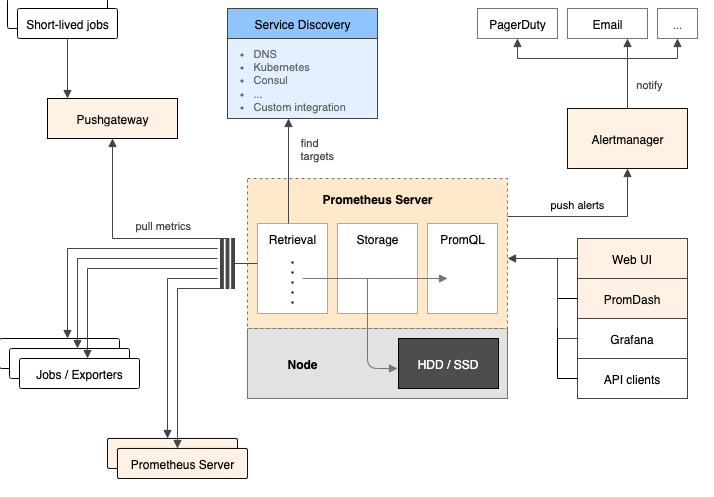

# Prometheus

## Architecture and Components

## About
Prometheus collects and stores its log-metrics as time series data, i.e. metrics information is stored with the timestamp at which it was recorded, alongside optional key-value pairs called labels.

## Prep PCA Exam
- `/exma/PCA.md`
- `/exma/exam-mock.md`

## Hands-On Training

### Prometheus UI
- Demo Prometheus UI: https://demo.promlabs.com/
- Demo Proemtheus Metrics: https://demo.promlabs.com/metrics

### Getting Started
1. `/getting-started/setup`
2. `/getting-started/instrumentator`
3. `/getting-started/recording-rules`
4. `/getting-started/alert-rules`
5. `/getting-started/alertmanager`
6. `/getting-started/blackbox-exporter`
7. `/getting-started/pushgateway`
8. `/getting-started/service-discovery`
9. `/getting-started/promql`

#### Setup Prometheus with k8s
1. `/kubernetes/setup`
2. `/kubernetes/exporter`
3. `/kubernetes/instrumentator`

#### AWS
1. `/aws/deploy_prometheus_ec2_server`
2. `/aws/scrape_ec2_instance`

#### Setup Grafana
- `/kubernetes/grafana`

#### PromQL
- `/exam/promql.md`
