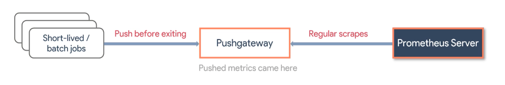

# Pushgateway
## About

The Pushgateway is an intermediary service which allows you to push metrics from jobs which cannot be scraped. For details, see Pushing metrics.

## Concept


## Setup
```bash
# run prometheus
docker-compose up -d

# check pushgateway
open http://localhost:9090/graph?g0.expr=up

# push another metrics
JOB_NAME=yuya-push
INSTANCE_NAME=hello_metrics
EVENT_NAME=event_123
echo "demo_metrics 123" | curl --data-binary @- http://localhost:9091/metrics/job/${JOB_NAME}/instance/${INSTANCE_NAME}/event/${EVENT_NAME}

# open prometheus and check batch job
open http://localhost:9091/

# verify the target
open http://localhost:9090/targets?search=pushgateway

# verify the metric
http://localhost:9090/graph?g0.expr=push_time_seconds

# push metrics via python app
pip install pip install prometheus-client
python app.py

# verfiy metrics
open http://localhost:9090/graph?g0.expr=pushgateway_http_push_duration_seconds

```